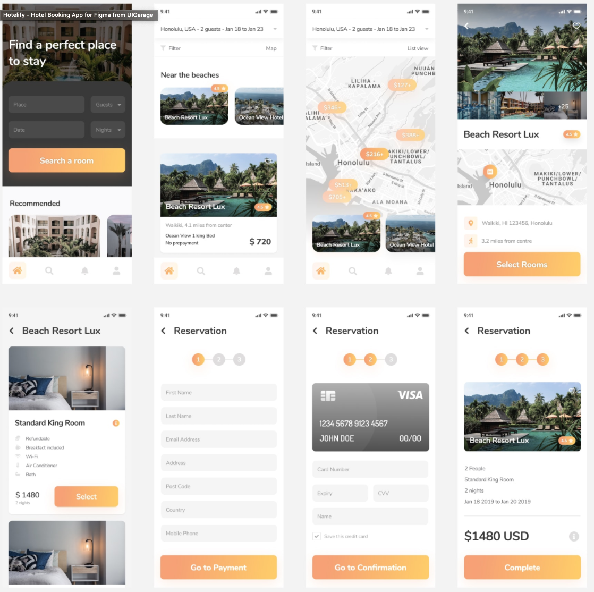
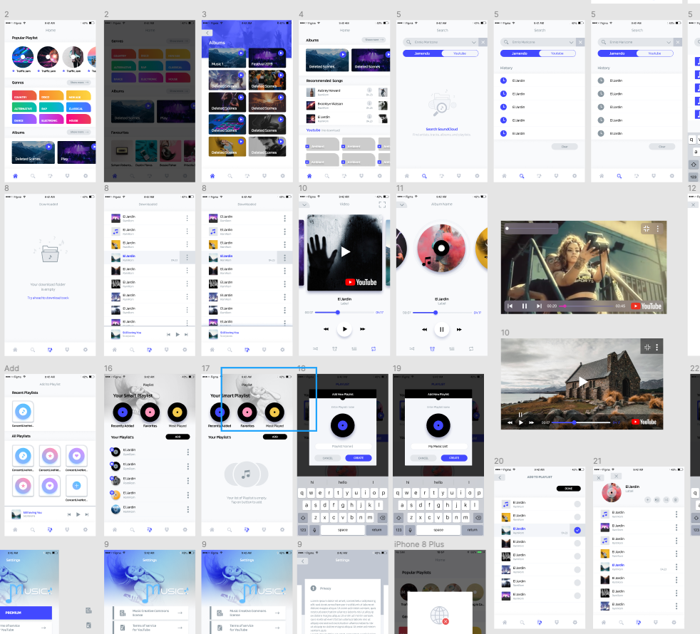
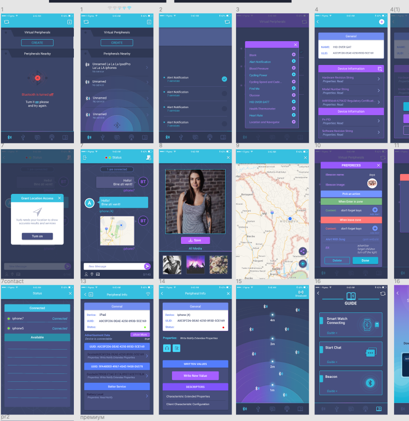
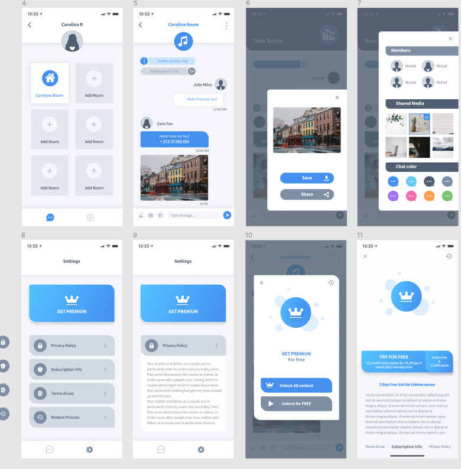
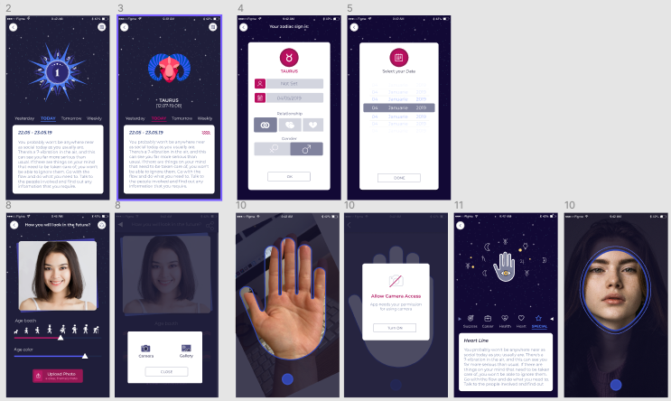
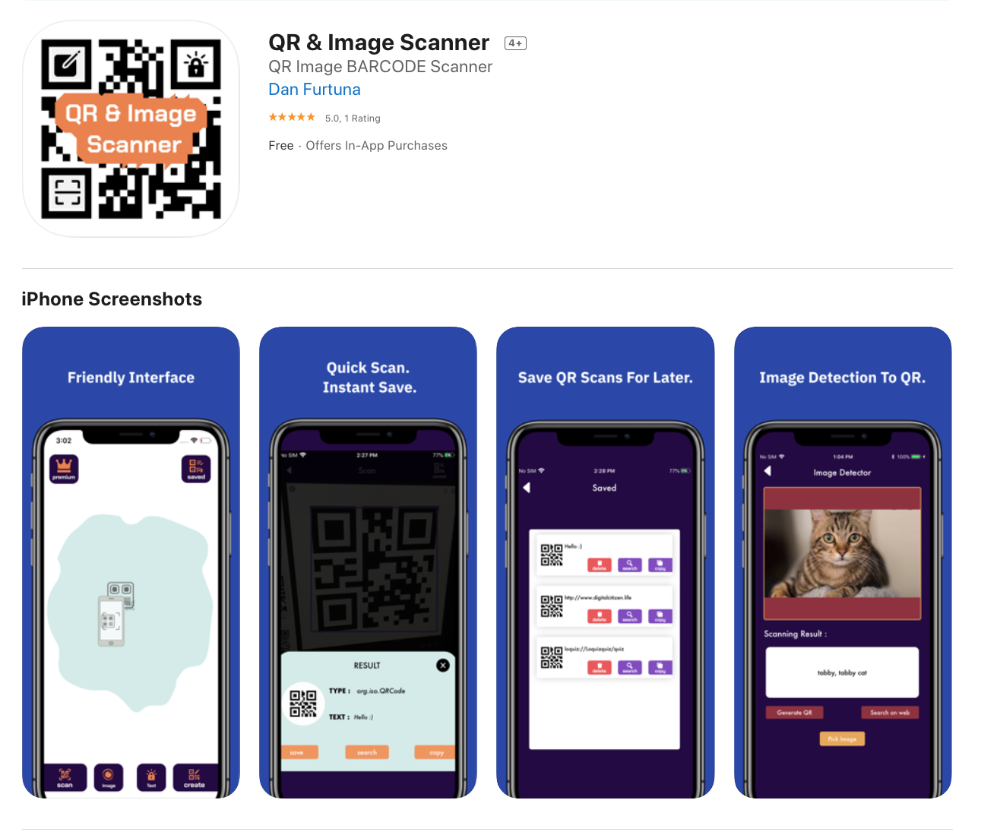
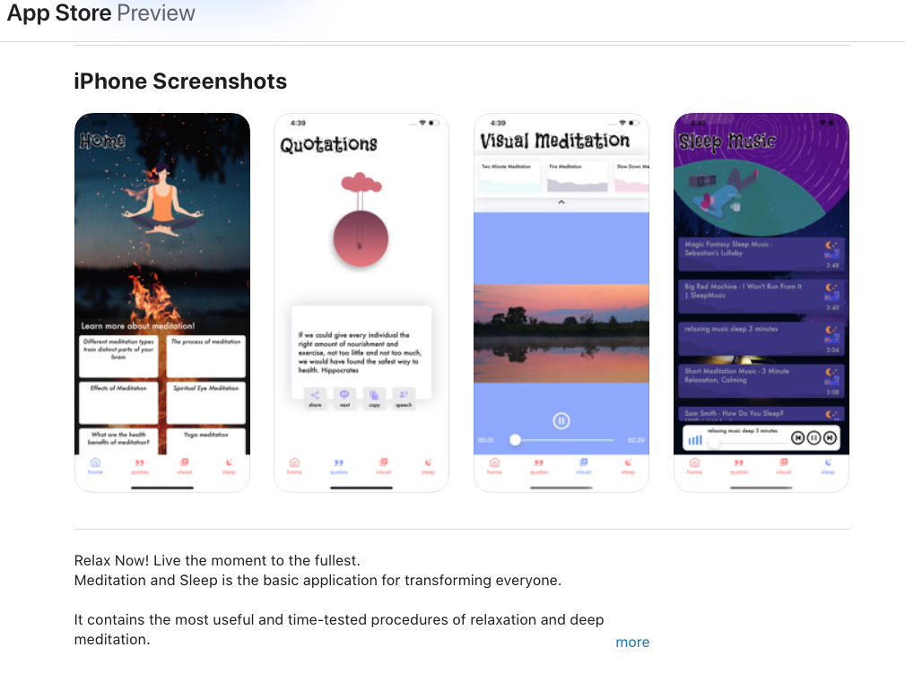
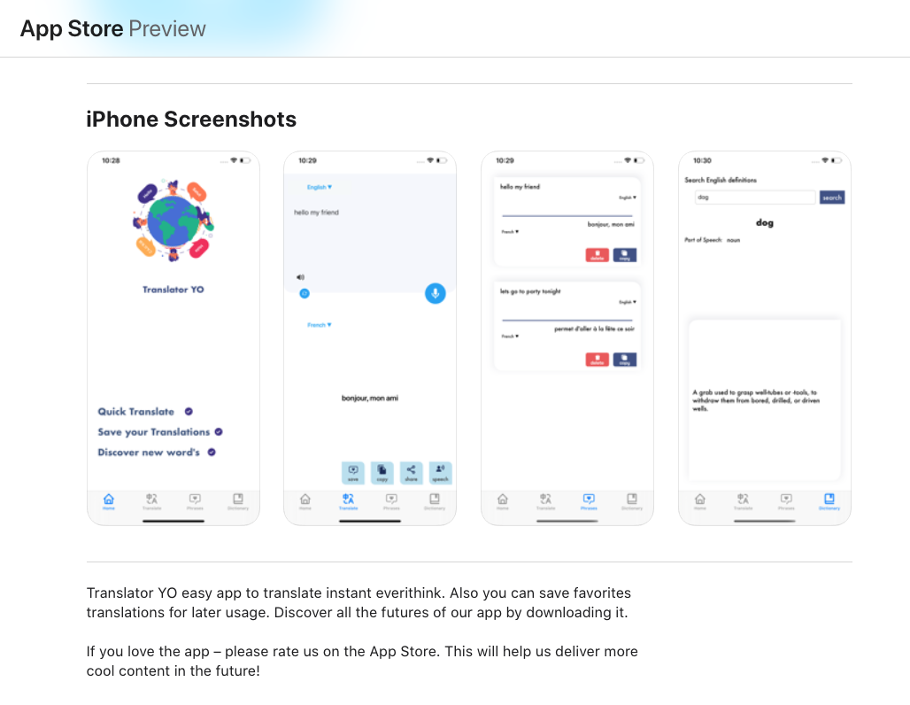

# IOS/React-Native Developer

&nbsp;&nbsp;&nbsp;
&nbsp;&nbsp;&nbsp;
&nbsp;&nbsp;&nbsp;

## Skills and Experience
* ⚛ React
* 📱 React Native
* 💻 JS, swift, 

## Table Of Content's :

- [React-Native Project's](#React-Native)

- [IOS-Work](#IOS-Work)

- [IOS-Freelance](#IOS-Freelance)

# React-Native
## Addons Factory for Minecraft

Addons Factory is a simple toolbox for creating your own mods and addons for MCPE. It is very easy to use but in the same time it has a lot of features and content. Also this app contains social media features. It allows you to share your addons with others, allow you to follow other users,likes and write comments, download or edit existing addons with a copyright system. 
<b>For this project I used:</b>  
 *React Native 
 *Redux 
 *React Navigation 
 *Figma 
 *Lottie 
 <b>In this project my part of work was:</b> 
 *UI Implementation 
 *Whole iOS and Android App 
 *In-App purchases 
 *Ad-Mob Advertising 
 *Preparing for publish to store 

  &nbsp;&nbsp;&nbsp;&nbsp;&nbsp;
  &nbsp;&nbsp;&nbsp;&nbsp;&nbsp;
  &nbsp;&nbsp;&nbsp;&nbsp;&nbsp;
  &nbsp;&nbsp;&nbsp;&nbsp;&nbsp;
  &nbsp;&nbsp;&nbsp;&nbsp;&nbsp;

 
 

## Hotelify(UI-only)
This project was made for learning purpose.
<a href="https://uigarage.net/ui-kit/hotelify-hotel-booking-app-for-figma"> hotelify-hotel-booking-app-for-figma </a>

<b>For this project I used:</b>  
 *React Native 
 *React Navigation 
 *NodeJs 

 
 

# IOS-Work
 +- 50, project's  
Most important of those :

## YTMusicPlayer
 YTMusicPlayer - listen to all youtube music. As same you can watch video.  
<b>For this project I used:</b>  
 *Swift/RxSwift/RxCocoa 
 *NativeAds(GoogleAds/StartUpSdk) 
 *Localization in 5+ languages 
 *Lottie 
 *DropBox 

 
 
 

## UltraBT
 UltraBT - discover ble peripherals, create virtual peripherals, share file's and more   
<b>For this project I used:</b>  
 *CoreBle 
 *MultiPeerConnection 

 
 
 

## UltraChat
 UltraChat - create rooms communicate via MultiPeerConnection , share images and many others.   
<b>For this project I used:</b>  
 *MultiPeerConnection 

 
 
 

## AstrologyApp
 AstrologyApp   
<b>For this project I used:</b>  
 *FaceDetection 
 *HoroscopeParsing 
 *Custom Slider 

 
 
  

# IOS-Freelance

## QR
QR & Image Scanner - easy  way to scan qr/bar codes detect object's on image. Also you can encrypt data before.   
<b>For this project I used:</b>  
 *Swift 
 *SwiftyStoreKit 
 *PdfKit 
 *Lottie 
 *Figma 
  

 
 

 
 

## Wally Finder
WallyFinder - discover a lot of photography content & Live's.  
<b>For this project I used:</b>  
 *Swift/RxSwift 
 *SwiftyStoreKit 
 *RestApi/Parsing 
 *Nuke 
 *DonwloadManager 
 *CustomTabBar 
 *Lottie 
 *CoreLocation 
 *Figma 
  

 
 

 
 

## Meditation and Sleep
Meditation and Sleep - relax your self by easy sounds and video effects.   

<b>For this project I used:</b>  
 *Swift 
 *SwiftyStoreKit 
 *PdfKit 
 *Lottie 
 *Figma 
  

 
 

 
 

## Translator YO

Translator YO - translate a lot of words with one tap , or you can use your voice. Find dictionary definition of word's and save your favourite phrases.   

<b>For this project I used:</b>  
 *Swift 
 *Firebase 
 *Yandex/GoogleApi 
 *Lottie 
 *Figma 
  

 
 

 
 
